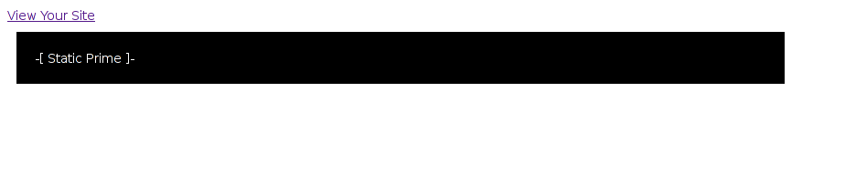
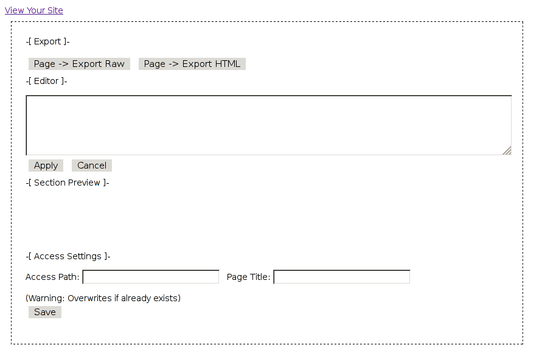
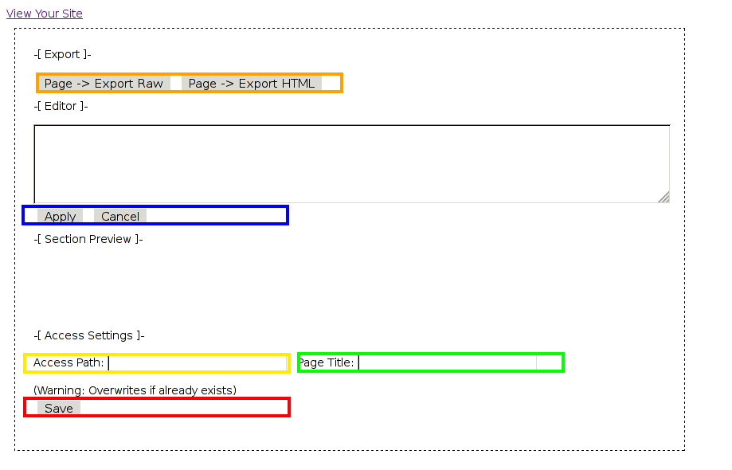
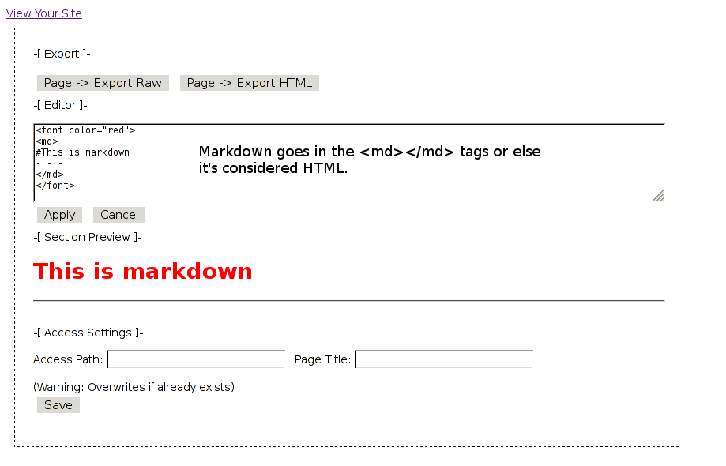
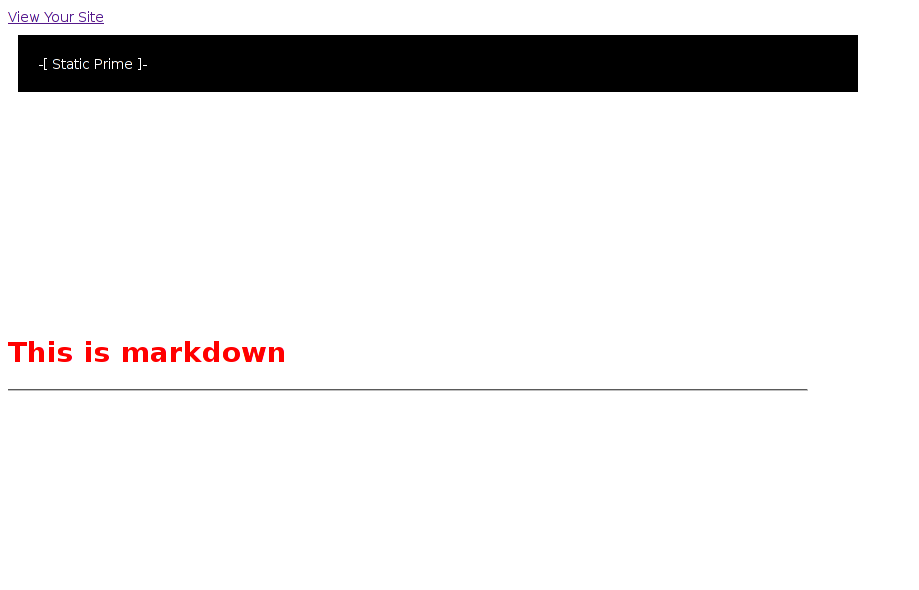
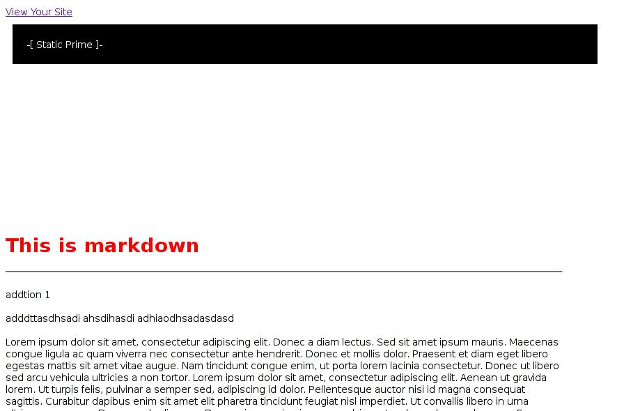
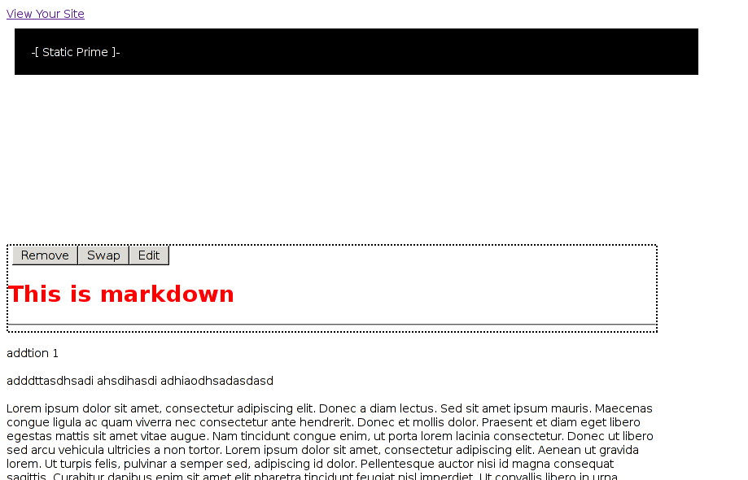
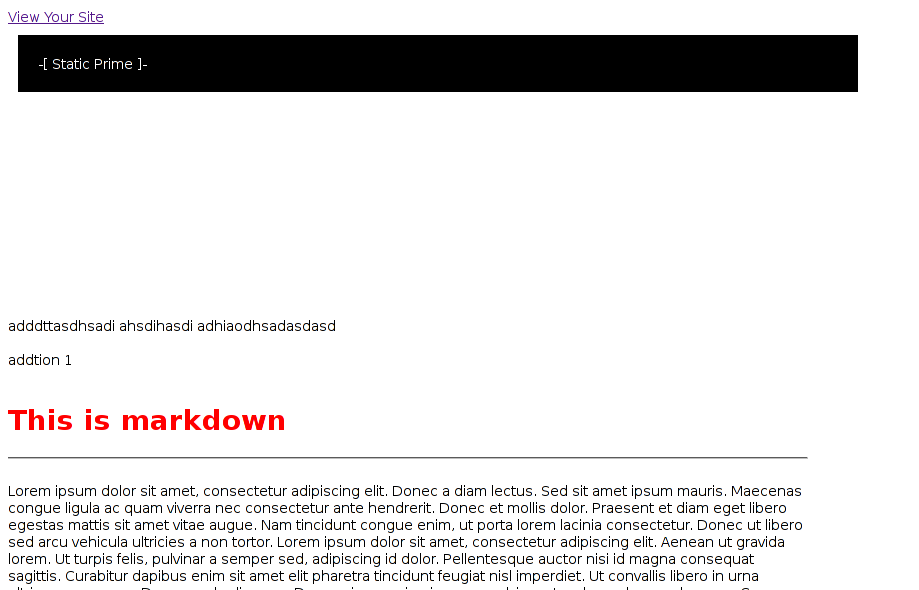
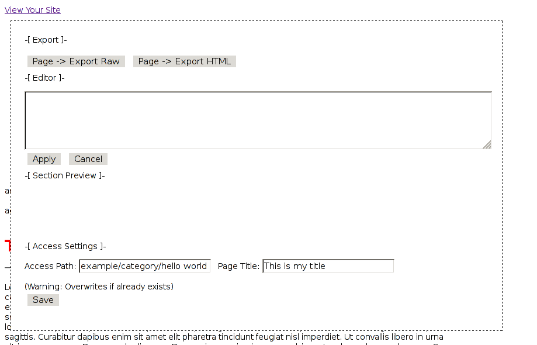
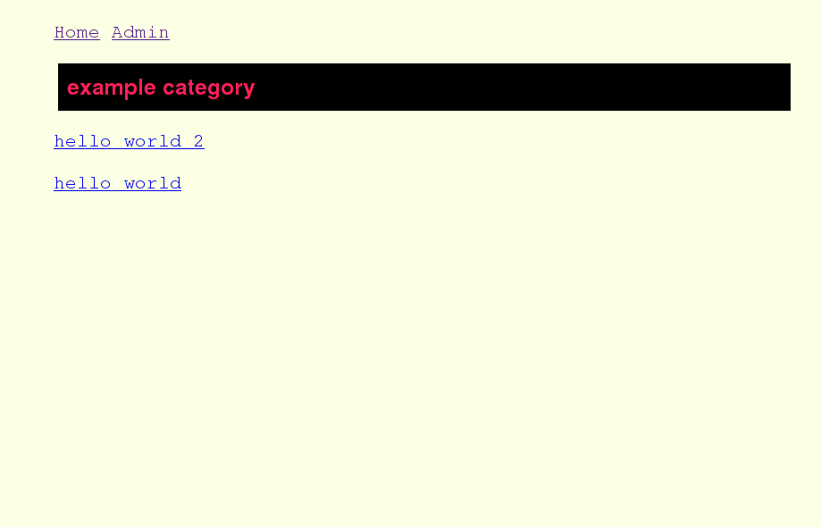

# Static Prime 
[](https://coderwall.com/runexec)

A static website editor and server written in Clojure and ClojureScript.

Supports
* in browser mouse only layout arrangement
* dynamic template loading for static files
* static site index
* multiple admins
* html and markdown editing
* write, edit, delete pages

<b>
<a href="https://github.com/runexec/Static-Prime/#visual">Visual Documentation</a>
<br />
<a href="https://vimeo.com/80591306">Video Demo (Vimeo)</a>
<br />
<a href="http://www.dailymotion.com/video/x17pggk_high-resolution-static-prime-a-static-website-editor-and-server-written-in-clojure-and-clojurescrip_tech">Video Demo (Dailymotion)</a>
</b>

<b>Install</b>

current version ```alpha-2```

Lein2 is required and can be found at http://leiningen.org/#install

```bash
# Download

wget https://github.com/runexec/Static-Prime/archive/Alpha-2.tar.gz

# Open archive

tar xf Alpha-2.tar.gz; cd Static-Prime-Alpha-2/

# Build JavaScript 

lein cljsbuild once
```
<b>Run</b>

```bash
lein ring server
```

## Admin Configuration

Admin logins are located at the top of ```src/static_prime/handler.clj``` and the login page is located at ```localhost:3000/admin```

Default Admins
```
(def auth-set 
  {"user1" "password1"
   "admin" "admin"})
```

<a id="visual" name="visual"></a>

## Editor


Once logged in as admin, place your mouse over the black bar at the top of the screen. The editor should drop down and look like the follow images.


**Before**

- - -


- - -


**After**


- - -



- - -


The following is a description of the image that follows after the next text body.

* In the orange annotation border, there are two buttons. One compiles all your page edits into a raw markup string ready for export. The other compiles all your page edits into a html string ready for export.

* In the blue annotation border, there are two buttons. The apply button will take the input placed in the editor and append it to your final page preview. If you're editing an existing section within the page preview, the section will be overwritten with the supplied input. The cancel button clears all input and erases the section preview section.

* In the yellow annotation border at the bottom, the access path is the routing path of the final document. This will be explained further in later documentation.

* In the green annotation border at the bottom is the title of the final document.

* The save button will write a flat file read to be served.

(NOTICE: This image is from the Alpha-1 release)

- - -



- - -


## Editor Input

The following is a description of the image that follows after the next text body.

* Markdown goes in the ```<md></md>``` tags or else it's considered HTML.

* The section preview is updated on every key press.


- - -



- - -


You have to click the apply button to add it to your final page preview.


- - -



- - -


Each time you add a section, it gets appended to the final page preview.


- - -



- - -


## Layout Arrangement

When you put your mouse over a page section, that section's menu will be displayed along with a dotted outline.


- - -



- - -


To alter the layout you can click the swap or remove buttons. When clicking the swap button, you will also have to click another section's swap button for the swap to take place. The header in this image is swapped with the third section.


- - -



- - -


## Saving Web Pages

In the following image, the access path is set to "example/category/hello world",
and the page title is set to "This is my title".


- - -



- - -


Clicking save make the proper directories and then write to the file "example/category/hello world". You'll be redirected to the new page once this has been completed.

With the default style template, this is what the new page looks like.


- - -



- - -


The static index is generated on every save event. Here's how the page is listed in the static index.


<i>Notice that the file name becomes the link and the parent paths become the header of the files</i>


- - -


- - -


## Editing Web Pages

<i>The admin bar only shows when you're logged in as admin</i>

Go to a page of your choice and click the edit button in the admin bar.

## Changes

alpha-2

* Links under each category are now least to greatest sorted

* Improved editing input and preview areas

* Fixed read/write errors for file names that end with white space

* Increased editor input and preview sizes + fixed css conflict

alpha-1

* Initial Release

## License

Copyright © 2013 runexec

Distributed under the Eclipse Public License either version 1.0 or (atyour option) any later version.
